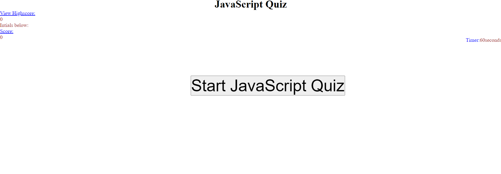

# JavaScript Quiz

https://github.com/Thaodev23/javascript-quiz

https://thaodev23.github.io/javascript-quiz/

## User Story

```
AS A developer I want to help educate future developers
I WANT to develope a JavaScript Quiz to test the knowledge of incoming students
SO THAT I can asses the knowledge of those students
```

## Acceptance Criteria

```
GIVEN students are taking the JavaScript Quiz
WHEN students are taking the test 
THEN there will be JavaScript questions that will test their knowledge
WHEN students are answering the questions
THEN students will be time with a limit of 60 seconds
WHEN students are finish with the quiz
THEN students are able to submit their initials along with their scores
WHEN students submit their score 
THEN students are presented with their own score and the highest score. 
```

## Image

Below: Sample images of the JavaScript quiz that students will be taking.



## Collaborators

```
Jason Yang - classmate whom assisted on the homework.
Github account - https://github.com/Jasony95
```
```
Sichoun Lee - classmate whom assisted on the homework.
Github account - https://github.com/DDXP3
```
